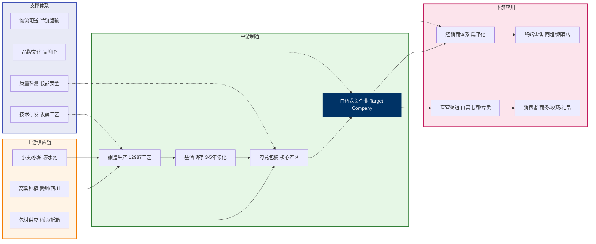
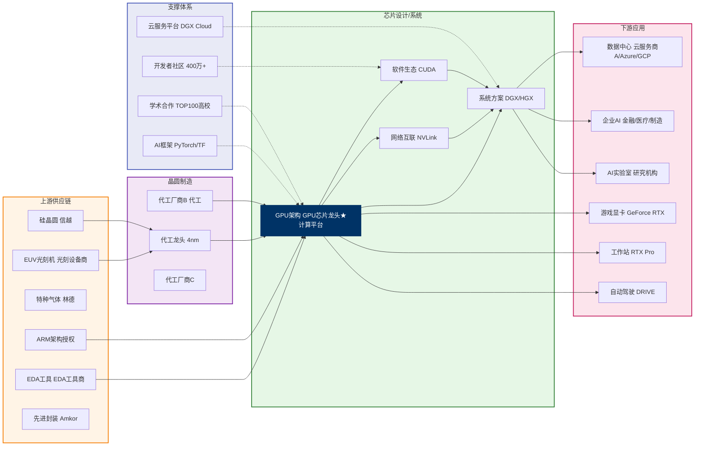
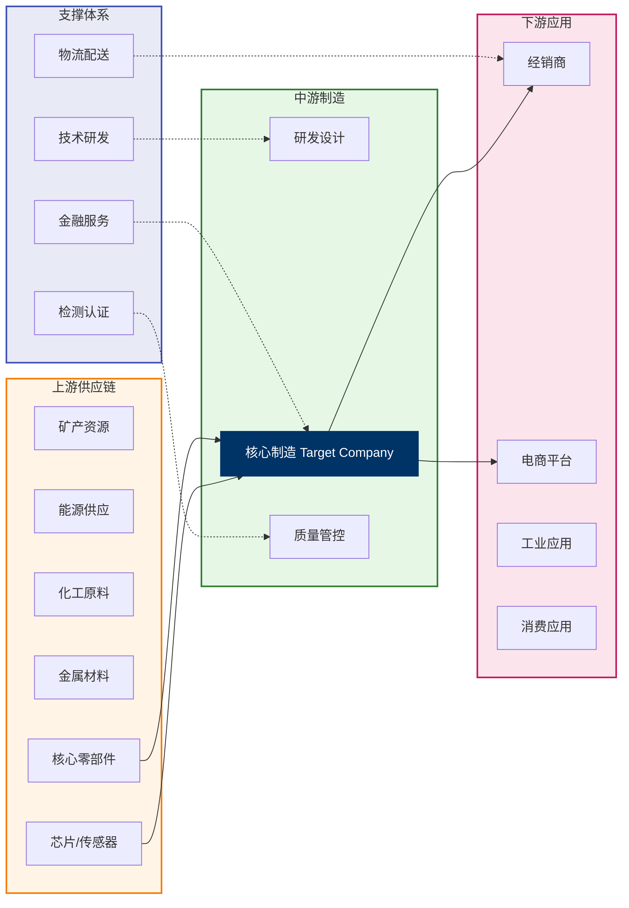
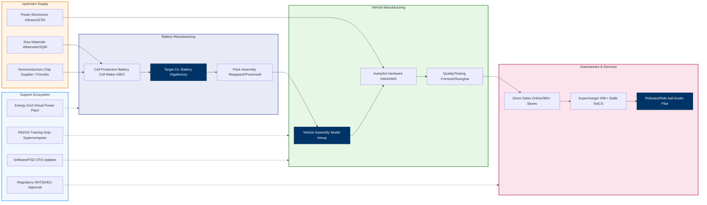

# Industry Value Chain Landscape Module Specification / 产业链全景图模块规范

> **Routing Rules (Agent must follow)**:
> - **Default use Mermaid flowchart LR** — whenever data sufficient (≥4 value chain levels), **always use Mermaid, no exceptions**
> - Value chain levels **< 4** (only 2-3 levels) → allow HTML/CSS flex layout only (see §Backup Plan)
> - ⛔ Prohibit fallback to pure text table, pure text description, or any non-graphic plan
> - If Mermaid render fails, try a few more times and methods to explore the environment. After 3rd failure, switch to HTML/CSS flex layout (don't degrade to table)
> - **Language agnostic**: Mermaid supports Chinese/English node labels, English reports also use Mermaid, not switching to HTML because English
>
> **Decision Flow**:
> ```
> Data levels ≥ 4 ──→ Mermaid flowchart LR (default, no exception)
> Data levels < 4 ──→ HTML/CSS flex (only allowed)
> Mermaid render fails ──→ HTML/CSS flex (cannot use table/text)
> ```

---

## Module Overview

**Module Position**: Mid-report, full row

**Core Requirements**:
- **Default use Mermaid flowchart LR** to draw 产业链 diagram (≥4 levels no exception)
- **Don't** use upstream→company→downstream simple three-part table
- **Must** deeply understand value chain landscape, excavate as many levels possible (target: ≥4 levels + support ecosystem)
- When data insufficient, must further search to expand, **don't be lazy**
- If Mermaid render fails, try a few more times and methods to explore the environment. 
- ⛔ Prohibit using pure table or pure text description replacing 产业链 diagram
- ⛔ When ≥4 levels, prohibit using HTML/CSS flex replacing Mermaid
- **Quality Standard**: Reference "[GPU Company] Value Chain Template (Gold Standard Example)" below—real company names, 5+ groups, downstream segmentation, target company highlighted dark, dashed support connections

---

## Value Chain Data Collection Standard (Mandatory)

### Level Excavation Target

**Minimum Requirement: 4 levels + support ecosystem**. Agent must actively search and expand until meeting following level count:

| Industry Type | Typical Level Count | Example Levels |
|---|---|---|
| Semiconductors/Electronics | 5-6 levels | Raw materials→Wafer fab→Chip design→Packaging/testing→Modules→Terminal devices |
| New Energy/Auto | 5 levels | Mineral resources→Battery materials→Cell manufacturing→Vehicle assembly→Sales/charging |
| Pharma/Biotech | 5 levels | Raw drugs→Intermediates→Formulation production→Distribution/hospitals→Patients |
| Consumer/Retail | 4 levels | Raw materials→Manufacturing→Brand/distribution→Retail→Consumers |
| Internet Platform | 3-4 levels | Supply side→Platform matching→Demand side→Payment/fulfillment (3 levels use HTML fallback) |
| Finance | 3-4 levels | Capital sources→Intermediary services→Capital deployment→Risk control/regulation (3 levels use HTML fallback) |

### Data Collection Strategy (Don't be lazy)

**Round 1: Basic Search**
- `[Industry] value chain landscape`
- `[Industry] upstream-downstream structure`
- `[Company Name] value chain position`

**Round 2: Deep Expansion (if Round 1 insufficient for 4 levels)**
- `[Industry] upstream raw materials/equipment suppliers`
- `[Industry] midstream manufacturing/processing steps`
- `[Industry] downstream distribution/channels/customers`
- `[Industry] support ecosystem/ancillary services`
- `[Industry] segment leaders`

**Round 3: Refinement (targeting company)**
- `[Company Name] suppliers`, `[Company Name] customers`
- `[Company Name] core business/product lines`
- `[Industry] technical routes/process steps`

### Data Collection Checklist

```markdown
□ Value chain level identification (target ≥4 levels)
  - Determine industry-specific value transmission paths (not limited to "raw materials→production→sales" paradigm)
  - Adjust level count by industry characteristics: target 4-6 levels
  - Reference typical models:
    • Manufacturing (upstream resources→base materials→core components→manufacturing→distribution→terminals)
    • Platform (supply side→platform→demand side→payment fulfillment)
    • Service (resources→service delivery→customers→feedback iteration)
    • Finance (capital sources→intermediaries→capital deployment→risk control→regulation)
    • IP/Content (creation→production→distribution→consumption→derivatives)
  - [Note] If search still insufficient 4 levels, means search insufficient depth, continue Round 2/Round 3

□ Core participants per level (3-5 representative companies/roles)
  - Annotate market share or industry position
  - Non-production companies: annotate role in value chain not process step
  - **Must use real company names** (e.g. "[specific battery manufacturer]" not "battery supplier")
  - ⛔ Prohibit using generic terms (e.g. "raw material suppliers" "downstream dealers") replacing specific company names

□ Target company upstream-downstream partners (key! Don't be lazy)
  - **Main Suppliers**: 3-5 core suppliers' real company names + supply content
    • Chinese companies: prioritize from 天眼查 `shareholder_info` / `supplier_info` API
    • Non-Chinese: from annual report Supply Chain Disclosure, Bloomberg SPLC, Web Search
  - **Main Customers**: 3-5 core customers' real company names + purchase content
    • Chinese companies: prioritize from 天眼查 `customer_info` / `shareholder_info` API
    • Non-Chinese: from annual report Customer Concentration, Bloomberg SPLC, Web Search
  - Annotate relationship type: long-term strategic partnership / exclusive supply / framework agreement / regular purchase
  - **Data authenticity requirement**: Supplier/customer names must have real sources, strictly prohibit fabrication. When 天眼查 has no data, use Web Search cross-verification

□ Target company's precise position in value chain
  - Annotate each concrete business node involved (multi-business companies may span multiple levels)
  - Clarify how it captures value (manufacturing/transaction matching/brand premium/tech licensing/...)

□ Upstream-downstream bargaining relationships
  - Supplier concentration, customer dependency, substitution threats
  - When applicable: platform two-side network effects strength, switching costs

□ Key connections and dependencies
  - Cross-level partnerships, tech licensing, exclusive supply and non-standard relationships
  - When applicable: regulatory approval nodes, data flows, capital flows

□ Support ecosystem (select by industry applicability)
  - May include: R&D/testing, logistics/warehousing, financial services, regulatory agencies,
    infrastructure, standards organizations, industry associations
```

---

## Rendering Pipeline (Critical — Sandbox-Only Playwright Scheme)

### Why Pre-Rendering is Mandatory

⚠️ **PDF renderers (WeasyPrint, headless browser `page.pdf()`) do NOT execute client-side JavaScript.**
Mermaid's text-to-SVG conversion requires a live browser JS engine. Embedding raw `<pre class="mermaid">` code in HTML will result in **blank diagrams or raw text** in the PDF.

**All Mermaid diagrams MUST be pre-rendered to images before embedding in HTML.**

### Sandbox Environment Constraint

These tools are unavailable. The most reliable rendering method is **Playwright** (via the browser automation toolkit). If Mermaid render fails, try a few more times and methods to explore the environment. **The sandbox may NOT have Node.js, Mermaid CLI (`mmdc`), Mermaid CLI, or Graphviz (`dot`).** 


### Playwright Pre-Rendering (Primary — Use This Every Time)

**Principle**: Use the sandbox's browser automation tools (`browser_visit`, `browser_screenshot`) to render Mermaid code to a PNG image, then embed as base64.

**Step-by-Step**:

```python
import base64

def render_mermaid_via_playwright(mermaid_code: str, output_path: str = '/tmp/chain_render.html') -> str:
    """
    Render Mermaid code to a base64 PNG using Playwright (sandbox browser toolkit).
    Returns: base64-encoded PNG string.
    """
    # Step 1: Build a standalone HTML file with Mermaid CDN
    html_content = f'''<!DOCTYPE html>
<html>
<head>
<meta charset="UTF-8">
<script src="https://cdn.jsdelivr.net/npm/mermaid@10/dist/mermaid.min.js"></script>
<script>
mermaid.initialize({{
    startOnLoad: true,
    theme: 'base',
    themeVariables: {{
        primaryColor: '#F5F8FC',
        primaryTextColor: '#1a1a1a',
        primaryBorderColor: '#003366',
        lineColor: '#1E3A5F',
        secondaryColor: '#FFF8E1',
        tertiaryColor: '#F1F8E9',
        quaternaryColor: '#FFEBEE',
    }},
    flowchart: {{
        htmlLabels: true,
        curve: 'basis',
        padding: 6,
        nodeSpacing: 30,
        rankSpacing: 70,
        useMaxWidth: true
    }}
}});
</script>
<style>
body {{ margin: 0; padding: 20px; background: white; }}
.mermaid {{ display: flex; justify-content: center; }}
</style>
</head>
<body>
<pre class="mermaid">
{mermaid_code}
</pre>
</body>
</html>'''

    # Step 2: Write to temp file
    with open(output_path, 'w', encoding='utf-8') as f:
        f.write(html_content)

    # Step 3: Open with browser_visit, screenshot, read and encode
    # Use mshtools-browser_visit to load the page
    # Use mshtools-browser_screenshot to capture (with sufficient wait)
    # Read the saved PNG and convert to base64
    # Return base64 string
```

**Recommended: Use IPython + playwright directly for batch rendering**:

```python
from playwright.sync_api import sync_playwright
import base64

def render_mermaid_to_png(mermaid_code: str) -> str:
    """Render Mermaid code to base64 PNG. Call this in IPython."""
    html = f'''<!DOCTYPE html>
<html><head><meta charset="UTF-8">
<script src="https://cdn.jsdelivr.net/npm/mermaid@10/dist/mermaid.min.js"></script>
<script>mermaid.initialize({{startOnLoad:true,theme:'base',themeVariables:{{primaryColor:'#F5F8FC',primaryTextColor:'#1a1a1a',primaryBorderColor:'#003366',lineColor:'#1E3A5F',secondaryColor:'#FFF8E1',tertiaryColor:'#F1F8E9',quaternaryColor:'#FFEBEE'}},flowchart:{{htmlLabels:true,curve:'basis',padding:6,nodeSpacing:30,rankSpacing:70,useMaxWidth:true}}}});</script>
<style>body{{margin:0;padding:20px;background:white;}}</style>
</head><body><pre class="mermaid">{mermaid_code}</pre></body></html>'''

    with open('/tmp/mermaid_render.html', 'w', encoding='utf-8') as f:
        f.write(html)

    with sync_playwright() as p:
        browser = p.chromium.launch()
        page = browser.new_page(viewport={'width': 1200, 'height': 800})
        page.goto('file:///tmp/mermaid_render.html')
        # Wait for Mermaid render: max 10 seconds
        page.wait_for_timeout(3000)  # minimum 3s for CDN load + render
        # Check if SVG rendered
        svg = page.query_selector('.mermaid svg')
        if svg:
            # Capture SVG element only
            png_bytes = svg.screenshot(type='png')
        else:
            # Fallback: screenshot full page
            png_bytes = page.screenshot(type='png', full_page=True)
        browser.close()

    return base64.b64encode(png_bytes).decode('utf-8')
```

> **⚠️ Important Notes for Playwright Rendering**:
> 1. **Timeout**: Use `page.wait_for_timeout(3000)` minimum (CDN download + render). Sandbox network may be slow.
> 2. **Chinese nodes**: Playwright renders Chinese correctly (unlike mermaid.ink which returns 400 for Chinese). No encoding issues.
> 3. **Viewport**: Use `viewport={'width': 1200, 'height': 800}` to ensure sufficient canvas width.
> 4. **No local mermaid.min.js needed**: CDN is reliable enough for single-shot renders. If CDN fails, HTML/CSS flex fallback kicks in.

### HTML/CSS Flex Fallback (When Playwright Fails)

**When to use**: Playwright crashes, Chromium download fails, or Mermaid CDN unavailable.

**Do NOT use**: Pure `<table>` or pure text description — validator #10 checks for `.chain-wrapper` or `.mermaid-container`.

See §Backup Plan at end of this file for complete HTML/CSS flex templates.

### SVG Embedding in HTML (After Playwright Render)

```html
<div class="module-row">
    <div class="section-title">Supply Chain Analysis</div>  <!-- or 产业链全景 -->
    <div class="mermaid-container">
        <div class="exhibit-label">
            <span class="exhibit-number">Exhibit X:</span>
            <span class="exhibit-desc">[Industry] Value Chain Landscape</span>
        </div>
        <!-- CORRECT: Pre-rendered image embedded as base64 -->
        <!-- ⚠️ MUST use chart-container-free (NOT chart-container!)
             chart-container has max-height:170px designed for stock charts.
             Industry chain diagrams need unrestricted height to display fully. -->
        <div class="chart-container-free">
            
        </div>
        <div class="data-source">Value Chain Research Analysis</div>
    </div>
</div>
```

> **Important**:
> - ⚠️ **Use `chart-container-free` class, NOT `chart-container`!** The `chart-container` class has `max-height: 170px` designed for stock price charts — using it for the industry chain diagram will truncate the image.
> - Do NOT use `<pre class="mermaid">` — raw Mermaid text will not render in PDF
> - Do NOT include `<script src="mermaid.min.js">` — no JS execution in PDF renderers
> - Embed the **pre-rendered base64 PNG image** via ``

### SVG Embedding in HTML (All Methods)

After rendering via Method 1, 2, or 3, embed the SVG directly in HTML:

```html
<div class="module-row">
    <div class="section-title">Supply Chain Analysis</div>  <!-- or 产业链全景 -->
    <div class="mermaid-container">
        <div class="exhibit-label">
            <span class="exhibit-number">Exhibit X:</span>
            <span class="exhibit-desc">[Industry] Value Chain Landscape</span>
        </div>
        <!-- CORRECT: Pre-rendered SVG embedded inline -->
        <!-- ⚠️ MUST use chart-container-free (NOT chart-container!)
             chart-container has max-height:170px designed for stock charts.
             Industry chain diagrams need unrestricted height to display fully. -->
        <div class="chart-container-free">
            <!-- Paste SVG content directly here (the entire <svg>...</svg>) -->
            PASTE_SVG_HERE
        </div>
        <div class="data-source">Value Chain Research Analysis</div>
    </div>
</div>
```

> **Important**:
> - ⚠️ **Use `chart-container-free` class, NOT `chart-container`!** The `chart-container` class has `max-height: 170px` designed for stock price charts — using it for the industry chain diagram will truncate the image.
> - Do NOT use `<pre class="mermaid">` — raw Mermaid text will not render in PDF
> - Do NOT include `<script src="mermaid.min.js">` — no JS execution in PDF renderers
> - Paste the full `<svg>...</svg>` output directly into the HTML
> - Alternatively, save SVG to file and use `` (ensure file is in same directory)

### Method 4: HTML/CSS Flex Layout (Last Resort)

See §Backup Plan below. Only use when **all three pre-rendering methods fail** OR when data has **< 4 value chain levels**.

---

## Mermaid Flowchart Template

### 白酒 Industry Template (Premium Spirits Example)

> **Layout Principle**: Don't specify `direction TB`, node labels single line, Mermaid auto-arranges under LR layout.



---

### [GPU Company] Value Chain Template (Gold Standard Example / Chinese)

> **This example is "gold standard" for value chain diagrams**. Every time generating, should reach similar quality:
> - [成立] Real company names (specific suppliers, foundries, tool vendors, cloud providers, etc)
> - [成立] 5 subgraph groups (upstream/manufacturing/design/support/downstream)
> - [成立] Downstream segmented into multiple sub-fields (data centers + consumer electronics)
> - [成立] Target company center position, dark highlight
> - [成立] Dashed lines (`-.->`) represent support ecosystem connections
> - [成立] Node labels compact, reduce `<br/>` usage to lower height
> - [成立] **Don't specify `direction TB`** — let Mermaid under LR layout auto-arrange horizontally, reduce total height



---

### Generic Four-Level Template

> **Note**: In template below, "core manufacturing""industrial applications" etc are placeholders. Actual generation must replace with target company's specific business names.
> **Layout Principle**: Don't specify `direction TB`, use single-line labels, Mermaid auto-arranges horizontally to reduce total height.



---

### [EV Company] Value Chain Template (English / 6 levels + support ecosystem)

> **Purpose**: Show complex value chain (≥5 levels) compact layout. Don't specify `direction TB`, single-line labels, reduce total height.



---

## Render Verification and Fallback

### Pre-Render Verification (MANDATORY)

⚠️ Raw Mermaid code in HTML will NOT render in PDF generation. Playwright pre-rendering is mandatory, not optional.

**Verification Steps** (run after Playwright render, before HTML embedding):

```python
import base64

def verify_rendered_image(png_base64: str) -> bool:
    """Verify Playwright-rendered image is valid."""
    try:
        img_bytes = base64.b64decode(png_base64)
        checks = {
            'is_png': img_bytes[:8] == b'\x89PNG\r\n\x1a\n',
            'has_content': len(img_bytes) > 1000,  # minimal PNG with content
            'not_empty': len(img_bytes) > 100,     # not a blank/1x1 image
        }
        return all(checks.values())
    except Exception:
        return False
```

### Fallback Logic (Sandbox-Optimized)

```
Playwright render ─── success ──→ base64 PNG ──→ embed  ──→ done
        │ fail (CDN timeout / Chromium unavailable)
        ▼
Fix Mermaid syntax → retry Playwright (max 1 retry)
        │ fail again
        ▼
HTML/CSS flex layout ──→ generate .chain-wrapper ──→ done
```

**Fallback Rules**:
- **≥4 value chain levels**: Use Playwright → base64 PNG embed. If Playwright fails after 1 retry → HTML/CSS flex.
- **< 4 value chain levels**: Skip Playwright, use HTML/CSS flex directly.
- Playwright retry: If first attempt fails (CDN timeout), wait 5 seconds and retry once. If still fails → immediate HTML/CSS flex fallback.
- **Never spend >60 seconds on rendering**. If Playwright + retry still fails, immediately fall back to HTML/CSS flex.
- **Never embed raw `<pre class="mermaid">` text in HTML destined for PDF**.

### ⛔ Absolute Prohibitions

- Prohibit using pure `<table>` table replacing value chain diagram
- Prohibit using pure text description replacing value chain diagram
- Prohibit embedding raw Mermaid code (`<pre class="mermaid">`) in PDF-destined HTML
- Prohibit including `<script src="mermaid.min.js">` in PDF-destined HTML
- `report_validator.py` check #10 will detect `.chain-wrapper`, `.mermaid-container`, or inline `` existence; pure table causes validation failure

### Post-Render Verification Checklist

```markdown
□ HTML contains one of:
  □ Inline <svg> inside .mermaid-container or .chart-container (Methods 1-3)
  □  referencing pre-rendered SVG/PNG (Methods 1-3 alternative)
  □ .chain-wrapper with .chain-box elements (Method 4 only)
□ HTML does NOT contain:
  □ <pre class="mermaid"> with raw flowchart code
  □ <script src="mermaid.min.js"> or any Mermaid JS import
□ SVG diagram shows:
  □ Target company node(s) highlighted dark (#003366)
  □ ≥4 subgroups/clusters visible (if data supports it)
  □ Real company names in nodes
  □ Flow direction left-to-right (LR)
```

---

## Data Expansion Strategy

When data insufficient, search expand per following keywords:
- Value chain depth: `[Industry] value chain analysis`, `[Industry] upstream-downstream relations`
- Enterprise data: `[Industry] main enterprises`, `[Industry] suppliers`, `[Industry] customers`
- Technical data: `[Industry] core technologies`, `[Industry] technical routes`
- Market data: `[Industry] market size`, `[Industry] competitive landscape`

---

## Design Principles

1. **Hierarchical Clarity**: Upstream→Midstream→Downstream, flow direction clear
2. **Multi-level**: Target ≥4 level structure (+ support ecosystem)
3. **Support Ecosystem**: Include R&D/testing/logistics/finance, etc.
4. **Company Business Precise Annotation (Mandatory)**: Target company every concrete business node involved must be dark-background highlighted (`fill:#003366`). Prohibit only highlighting one node!
   - Example: [GPU芯片龙头] involves GPU architecture design (C1), network interconnect (C2), system solutions (C3), software ecosystem (C4) → **all four nodes** `fill:#003366,stroke-width:3px`
   - Example: [目标公司] involves power battery (M1), electric drive system (M3), vehicle assembly (M4), new energy vehicle (D1) → **five nodes all** dark blue
   - Most core main node use `stroke-width:4px`, other business nodes use `stroke-width:3px`
5. **LR Layout**: Left to right, suitable for A4 landscape display
6. **Node Simplification**: 3-5 nodes per segment, avoid excessive complexity

### Layout Optimization: Control SVG Height (Bypass PDF skill Limit)

PDF skill limit: Mermaid SVG exceeding A4 page height breaks Paged.js pagination. Bypass not by reducing nodes, but by **optimizing layout for same content with less height**:

| Optimization Method | Original (High) | New (Low) | Effect |
|---|---|---|---|
| **Remove `direction TB`** | `subgraph X { direction TB; A; B; C; }` | `subgraph X { A; B; C; }` | Nodes arrange horizontally, subgraph height drops 50%+ |
| **Reduce `<br/>`** | `A[动力电池<br/>[目标公司]]` | `A[动力电池 [目标公司]]` | Node height drops from ~60px to ~30px |
| **Increase rankSpacing** | `rankSpacing: 45` | `rankSpacing: 70` | Level spacing larger, diagram flatter |
| **SVG Scaling Fallback** | None | JS detects >900px auto CSS scale | Last defense, no content loss |

**SVG height detection script already injected in HTML**: After render complete, detect SVG height, when exceeding 900px (A4 available height) auto `transform: scale()` shrink, doesn't break Paged.js pagination.

---

### Target Company Business Annotation Standard (Mandatory)

**Core Rule: Value chain diagram value not showcasing industry landscape, but letting readers see at glance target company's exact position on chain and business boundary.**

1. **Prohibit Generic Node Names**: Don't use "midstream manufacturing""downstream application" generic terms as target company node names. Must use specific business names:
   - [Invalid] `M2[中游制造 Target Company]`
   - [Valid] `M2[动力电池制造 [目标公司]]` / `M3[整车装配 [目标公司]]`

2. **Multi-Business Multi-Node**: If target company business spans multiple value chain segments, each segment must have independent annotation node:
   ```mermaid
   %% [目标公司] example: spans midstream+downstream
   subgraph MID["中游制造"]
       M1[动力电池<br/>电池子公司] --> M2[电池包装配<br/>[目标公司]★]
       M3[电驱系统<br/>[目标公司]★] --> M4[整车装配<br/>[目标公司]★]
   end
   subgraph DOWN["下游应用"]
       D1[新能源乘用车<br/>[目标公司]★] --> D3[终端消费者]
       D2[商用车/客车<br/>[目标公司]★] --> D3
   end
   %% All [目标公司] nodes dark color
   style M2 fill:#003366,stroke:#003366,color:#fff
   style M3 fill:#003366,stroke:#003366,color:#fff
   style M4 fill:#003366,stroke:#003366,color:#fff
   style D1 fill:#003366,stroke:#003366,color:#fff
   style D2 fill:#003366,stroke:#003366,color:#fff
   ```

3. **Cross-industry Company Handling**: When target company business spans multiple unrelated industries (like a conglomerate's semiconductors+consumer electronics+finance):
   - **Plan A (Preferred)**: Only draw core business (revenue >50%) value chain, remaining business shown in 公司概览 module business structure table
   - **Plan B**: Draw parallel dual chains, using two independent `flowchart LR` stacked vertically, each chain's target company node same dark color
   - **Plan C**: Single diagram using multiple subgraph zones showing each business line, target company nodes can span multiple zones

4. **Specific Company Names**: Upstream supplier, downstream customer nodes should label real companies (e.g. "[电池龙头企业]" not "battery supplier") when possible; when data insufficient can use "[XX industry] leader" substitute

---

## Value Chain Generation Checklist

### Pre-generation Check

```markdown
□ Data Collection (don't be lazy)
  □ Executed ≥2 search rounds (basic+deep expansion)
  □ Value chain levels ≥4 (5 groups if including support ecosystem)
  □ If <4 levels, attempted Round 3 refinement search
  □ Target company position in value chain clear
  □ Each target company business segment identified (cannot use generic "midstream manufacturing" substitute)
  □ Cross-industry company determined layout plan (single chain/dual chain/multi-zone)
  □ [Critical] Main suppliers found real company names (天眼查 priority)
  □ [Critical] Main customers found real company names (天眼查 priority)
  □ [Critical] Node labels use specific company names, prohibit generic terms

□ Mermaid Code Writing
  □ Use flowchart LR (left-right layout)
  □ Use subgraph grouping (upstream/midstream/downstream/support, etc), ≥4 groups
  □ Total nodes > 20 (sufficient value chain depth showcase)
  □ Node labels accurate specific, <15 chars, single-line reduce height
  □ Target company node dark highlight (fill:#003366,stroke-width:4px)
  □ Each group color-distinguished (upstream #FFF4E6/midstream #E6F7E6/downstream #FCE4EC/support #E8EAF6)
  □ Upstream-downstream key enterprises use real names
  □ Don't specify direction TB, nodes auto arrange horizontally reduce height
```

### HTML Integration Check

```markdown
□ Rendering Method
  □ Playwright pre-render: Mermaid code → browser_visit → screenshot → base64 PNG
  □ OR HTML/CSS flex layout (only if Playwright fails after 1 retry or <4 layers)
  □ No <script src="mermaid.min.js"> in final HTML
  □ No raw <pre class="mermaid"> code in final HTML

□ HTML Structure
  □ Pre-rendered image embedded as  inside .chart-container-free
  □ OR .chain-wrapper with .chain-box elements (HTML fallback only)
  □ ⚠️ Use .chart-container-free (NOT .chart-container with 170px limit!)
  □ Include exhibit-label (chart number and description)
  □ Include data-source (data source annotation)
```

### Post-render Check

```markdown
□ Render Quality
  □ Chart complete display, no truncation
  □ Node text clear readable
  □ Colors display correct
  □ Target company highlighted
  □ Flow direction clear (arrow direction correct)

□ Layout Check
  □ Chart width suitable for A4 page
  □ Spacing with above/below content appropriate
  □ No cross-page problems

□ Chart Validation
  □ HTML contains .mermaid-container (with Mermaid code) — default path
  □ OR HTML contains .chain-wrapper (with .chain-box) — only <4 level fallback path
  □ Not using pure table or pure text substitute
```

---

## Common Issues Troubleshooting

| Issue | Possible Cause | Solution |
|---|---|---|
| Diagram blank in PDF | Raw Mermaid not pre-rendered | Must use Playwright pre-render to base64 PNG |
| Playwright timeout | Mermaid CDN slow/unavailable | Wait 3s minimum; retry once; then HTML/CSS flex fallback |
| Node text garbled | Chinese font issue | Playwright handles Chinese natively; if garbled check font config |
| Chart too wide overflow | Too many nodes/long text | Streamline nodes, shorten labels, remove direction TB |
| Colors not display | style syntax error | Check style format: style node-ID fill:#color |
| Arrow direction wrong | Connection syntax error | Use --> indicate direction |
| Groups not display | subgraph syntax error | Ensure subgraph has name and end |

---

## Data Sources

| Data Type | Data Source | Search Keywords |
|---|---|---|
| Value chain structure | 天眼查, Web Search | `[Industry] value chain analysis` |
| Supplier info | 天眼查 | `[Company Name] suppliers` |
| Customer info | 天眼查 | `[Company Name] customers` |
| Industry report | 财新, Web Search | `[Industry] industry research report` |

---

## Backup Plan: HTML/CSS Flex Layout (only <4 levels or Mermaid render failure)

> [Note] **This section is backup plan, non-standard path. ≥4 levels default use Mermaid, don't actively choose HTML.**
>
> **Style definitions in `output/tearsheet.css` Section 26** (`.chain-*` classes), generating HTML no need inline CSS.

### When to Use (satisfy any)

1. Value chain levels **< 4** (only 2-3 levels) — this is normal fallback
2. Mermaid pre-render failed and data levels < 4 — render issue fallback
3. Platform/Finance type naturally fewer levels — industry characteristic fallback

### Design Principles

1. **Dynamic column count**: flex layout naturally supports 2-3 content columns (with arrow connectors between columns)
2. **Equal height alignment**: `.chain-row` use `align-items: stretch` ensure all columns in row equal height
3. **Box styling**: white background (#fff), 1.5px solid #CFD8DC border, 5px border-radius, 6-8px padding
4. **Target company node**: `.target-node` — 3.5px left border #003366 (dark blue), light blue background (#F5F8FC), dark blue title text
5. **Arrow connectors**: CSS pseudo-elements generate visual arrow line + arrow (prohibit using text "→")
6. **Section headers**: colored bottom border — upstream (blue #1976D2), midstream (green #2E7D32), company (dark blue #003366), downstream (orange #E65100)
7. **Font size**: title 7.5pt bold, subtitle 6.5pt gray
8. **Outer frame**: light border (#E0E0E0), 4px round corner, #FAFAFA background

### HTML Structure Template

#### 3-Column Example (Platform: Supply Side → Platform → Demand Side)

```html
<div class="chain-wrapper">
  <div class="chain-row">
    <div class="chain-col">
      <div class="chain-col-header" style="border-color:#1976D2; color:#1565C0;">Supply Side</div>
    </div>
    <div class="chain-connector"></div>
    <div class="chain-col">
      <div class="chain-col-header" style="border-color:#003366; color:#003366;">[Company] Platform</div>
    </div>
    <div class="chain-connector"></div>
    <div class="chain-col">
      <div class="chain-col-header" style="border-color:#E65100; color:#BF360C;">Demand Side</div>
    </div>
  </div>
  <!-- Content rows... -->
  <div class="chain-row">
    <div class="chain-col">
      <div class="chain-box"><div class="cb-title">[Supplier/Content Provider]</div><div class="cb-sub">[Role]</div></div>
    </div>
    <div class="chain-connector"><div class="arrow-line"></div></div>
    <div class="chain-col">
      <div class="chain-box target-node"><div class="cb-title">[Platform Core Function]</div><div class="cb-sub">[Profit Model]</div></div>
    </div>
    <div class="chain-connector"><div class="arrow-line"></div></div>
    <div class="chain-col">
      <div class="chain-box"><div class="cb-title">[User/Customer]</div><div class="cb-sub">[Demand Scenario]</div></div>
    </div>
  </div>
</div>
```

#### 4-Column Example (Simple Linear: Upstream → Midstream → Company → Downstream)

```html
<div class="chain-wrapper">
  <div class="chain-row">
    <div class="chain-col">
      <div class="chain-col-header" style="border-color:#1976D2; color:#1565C0;">Upstream Supply</div>
    </div>
    <div class="chain-connector"></div>
    <div class="chain-col">
      <div class="chain-col-header" style="border-color:#2E7D32; color:#2E7D32;">Midstream Manufacturing</div>
    </div>
    <div class="chain-connector"></div>
    <div class="chain-col">
      <div class="chain-col-header" style="border-color:#003366; color:#003366;">[Company] Core Business</div>
    </div>
    <div class="chain-connector"></div>
    <div class="chain-col">
      <div class="chain-col-header" style="border-color:#E65100; color:#BF360C;">Downstream Market</div>
    </div>
  </div>
  <!-- Content rows (repeat N rows) -->
  <div class="chain-row">
    <div class="chain-col">
      <div class="chain-box"><div class="cb-title">[Supplier Name]</div><div class="cb-sub">[Segment]</div></div>
    </div>
    <div class="chain-connector"><div class="arrow-line"></div></div>
    <div class="chain-col">
      <div class="chain-box"><div class="cb-title">[Manufacturing Step]</div><div class="cb-sub">[Process/Product]</div></div>
    </div>
    <div class="chain-connector"><div class="arrow-line"></div></div>
    <div class="chain-col">
      <div class="chain-box target-node"><div class="cb-title">[Company Core Business]</div><div class="cb-sub">[Specific Product Line]</div></div>
    </div>
    <div class="chain-connector"><div class="arrow-line"></div></div>
    <div class="chain-col">
      <div class="chain-box"><div class="cb-title">[Downstream Customer/Scenario]</div><div class="cb-sub">[Market Characteristic]</div></div>
    </div>
  </div>
</div>
```

### Language Variants

**Chinese (A股 / 港股)**
- Headers flexibly named by industry, example:
  - Manufacturing: 上游供应 / 中游制造 / [公司] 核心业务 / 下游市场
  - Platform: 供给侧 / [公司]平台 / 需求侧
  - Finance: 资金来源 / [公司]中介服务 / 资金运用
- Use Chinese company and product names

**English (US stocks)**
- Headers example:
  - Manufacturing: Upstream Supply / Midstream / [Company] Core / Downstream
  - Platform: Supply Side / [Company] Platform / Demand Side
- Use English names

### Page-Break Rules

Entire value chain diagram must wrap in `page-break-inside: avoid`. `.chain-wrapper` CSS already includes this rule, no need extra wrapping.

# Module 8: Upstream-Downstream Deep Analysis / 上下游深度分析

> **Difference from Module 7 (Value Chain Landscape)**:
> - Module 7 is **landscape diagram** (Mermaid flowchart, shows overall structure and flow)
> - Module 8 is **deep analysis** (text + bullet, shows supplier/customer specific data and bargaining power)
> - Two adjacent but independent content

## Module Position

Report second half, below 产业链全景图 (Module 7).

## Layout: Left-Right Dual Box (Default)

- **Left Box**: Upstream analysis (border-color: `#F57C00`)
- **Right Box**: Downstream analysis (border-color: `#C2185B`)

### Upstream Analysis Box Template

```markdown
**上游供应结构**

Core Suppliers:
• [Supplier 1]: [Supply content], market share [X]%, [bargaining position]
• [Supplier 2]: [Supply content], market share [X]%, [bargaining position]
• [Supplier 3]: [Supply content], market share [X]%, [bargaining position]

Raw Material Market: [Market landscape description, e.g. "High lithium concentration, Australia+South America dominant"]

Bargaining Power: [Strong/Medium/Weak] — [Judgment basis]

Supply Risk: [Main risk points] → [Mitigation measures/alternatives]
```

### Downstream Analysis Box Template

```markdown
**下游需求结构**

Core Customers:
• [Customer 1]: [Purchase content], [X]% share, [customer characteristic]
• [Customer 2]: [Purchase content], [X]% share, [customer characteristic]
• [Customer 3]: [Purchase content], [X]% share, [customer characteristic]

Terminal Market: [Demand characteristic description, e.g. "B2B dominant, C2C penetration accelerating"]

Bargaining Power: [Strong/Medium/Weak] — [Judgment basis]

Channel Changes: [Recent channel structure change trends]
```
